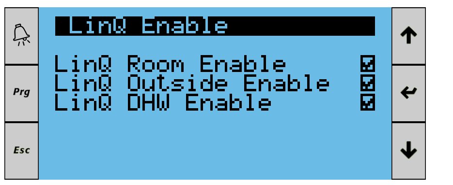

# HR-energy

[](https://homey.app/en-nl/app/com.hr-energy.qube/HR-energy/)
[](LICENSE)

Homey app for the **HR-energy Qube** heatpump. Communicates with the unit over **Modbus TCP** to read real-time sensor data, monitor alarms, control setpoints, and automate your heatpump directly from Homey.

## Disclaimer

> **This is an unofficial, community-developed integration.**
>
> - Not affiliated with, endorsed by, or supported by **HR-energy**.
> - HT-energy may change or discontinue these interfaces at any time without notice — app functionality may break as a result.
> - Use at your own risk. The developers accept no liability for data loss, incorrect readings, or unintended battery mode changes.

## Supported Devices

| Model                         | Modbus Support  | Notes                              |
|-------------------------------|-----------------|------------------------------------|
| Qube Heat Pump (all variants) | ✅             | Primary supported device           |
| Qube with Linq thermostat     | ✅             | Can disable Linq for Homey control |

## Firmware Compatibility

The integration is tested with current Qube firmware versions. If you encounter issues with a specific firmware version, please open an issue on GitHub with your firmware version and the problem description.

## Requirements

- Qube heatpump connected to your local network via **Ethernet**
- **Modbus TCP enabled** on the heatpump (default port: 502)
- Network access from Homey to the heatpump IP address

## Installation

### Via Homey App Store

Search for **"HR-energy"** in the Homey App Store.

### Via CLI (sideloading / development)

```bash
npm install -g homey
git clone https://github.com/rcoemans/com.hr-energy.qube
cd com.hr-energy.qube
homey login
homey app install
```

## Setup

1. Install the app on your Homey.
2. Add a new device: **HR-energy → Qube**.
3. The pairing wizard will ask for the **IP address**, **port** (default 502), **Modbus unit ID** (default 1), and **poll interval** (default 5000 ms). Enter the IP address of your Qube and adjust the other settings if needed.
4. Confirm the device to complete pairing.
5. The device will connect automatically and start reading data.
6. You can change connection settings later in the device **Settings** page.

## Device Variables

All capabilities exposed by the Qube device, with their variable name (as used in flows/tags) and data type.

| Variable                         | Type          |
|----------------------------------|---------------|
| `qube_alarm_global`              | boolean       |
| `qube_unitstatus_raw`            | number        |
| `qube_status`                    | string        |
| `qube_temp_supply`               | number        |
| `qube_temp_return`               | number        |
| `qube_temp_source_in`            | number        |
| `qube_temp_source_out`           | number        |
| `qube_temp_room`                 | number        |
| `qube_temp_dhw`                  | number        |
| `qube_temp_outdoor`              | number        |
| `qube_flow`                      | number        |
| `qube_cop`                       | number        |
| `qube_power`                     | number        |
| `qube_meter_electric`            | number        |
| `qube_energy_thermal`            | number        |
| `qube_power_thermal`             | number        |
| `qube_compressor_speed`          | number        |
| `qube_hours_dhw`                 | number        |
| `qube_hours_heating`             | number        |
| `qube_hours_cooling`             | number        |
| `qube_heating_dt`                | number        |
| `qube_source_dt`                 | number        |
| `qube_runtime_efficiency`        | number        |
| `qube_season_mode`               | enum (string) |
| `qube_heating_setpoint_day`      | number        |
| `qube_heating_setpoint_night`    | number        |
| `qube_cooling_setpoint_day`      | number        |
| `qube_cooling_setpoint_night`    | number        |
| `qube_dhw_setpoint`              | number        |
| `qube_source_pump`               | boolean       |
| `qube_user_pump`                 | boolean       |
| `qube_fourway_valve`             | boolean       |
| `qube_threeway_valve`            | boolean       |
| `qube_heater1`                   | boolean       |
| `qube_heater2`                   | boolean       |
| `qube_alarm_flow`                | boolean       |
| `qube_alarm_heating`             | boolean       |
| `qube_alarm_cooling`             | boolean       |
| `qube_alarm_source`              | boolean       |
| `qube_alarm_user`                | boolean       |
| `qube_alarm_legionella_timeout`  | boolean       |
| `qube_alarm_dhw_timeout`         | boolean       |
| `qube_alarm_working_hours`       | boolean       |

## Sensor Data (read-only)

All values are polled from the Qube's Modbus input registers and rounded to two decimals.

| Capability             | Description                                         | Unit  |
|------------------------|-----------------------------------------------------|-------|
| Supply Temperature     | Water temperature leaving the heatpump              | °C    |
| Return Temperature     | Water temperature returning to the heatpump         | °C    |
| Source In Temperature  | Source loop inlet temperature (ground/water source) | °C    |
| Source Out Temperature | Source loop outlet temperature                      | °C    |
| Room Temperature       | Room temperature sensor reading                     | °C    |
| DHW Temperature        | Domestic hot water tank temperature                 | °C    |
| Outdoor Temperature    | Outside air temperature                             | °C    |
| Flow                   | Water flow rate through the system                  | l/min |
| COP                    | Coefficient of Performance — indicates real-time efficiency. A COP of 4.0 means 4 kWh of heat for every 1 kWh of electricity consumed. | — |
| Electric Power         | Current electrical power consumption                | W     |
| Electric Energy        | Cumulative electrical energy consumed               | kWh   |
| Thermal Energy         | Cumulative thermal energy produced                  | kWh   |
| Unit Status            | Decoded operating state (Standby, Heating, Cooling, DHW Heating, Compressor Starting, Compressor Shutting Down, Start Failed, Alarm, Keyboard Off) using raw Modbus values 1–22 | — |
| Thermal Power          | Current thermal heat output                         | W    |
| Compressor Speed       | Current compressor rotational speed                 | rpm  |
| Working Hours DHW      | Cumulative compressor hours for domestic hot water  | h    |
| Working Hours Heating  | Cumulative compressor hours for central heating     | h    |
| Working Hours Cooling  | Cumulative compressor hours for cooling             | h    |
| Heating ΔT             | Supply − Return temperature difference (helps spot hydraulic issues) | °C |
| Source ΔT              | Source In − Source Out temperature difference (heat extracted from source) | °C |
| Runtime Efficiency     | Thermal kWh / heating hours (long-term system performance indicator) | kWh/h |

## Digital Outputs (read-only)

Real-time status of pumps, valves, and backup heaters — read from the Qube's discrete inputs.

| Capability               | Description                                                             |
|--------------------------|-------------------------------------------------------------------------|
| Source Pump              | Source loop circulation pump active                                     |
| CV Pump                  | Central heating circulation pump active                                 |
| Four-way Valve           | Four-way reversing valve position                                       |
| Three-way Valve (CV/DHW) | Three-way valve directing flow to central heating or domestic hot water |
| Heater 1                 | Backup electric heater step 1 active                                    |
| Heater 2                 | Backup electric heater step 2 active                                    |

## Controls (read/write)

These capabilities appear on the device tile and can be changed directly from the Homey UI or via flow cards. The current value is read back from the heatpump during each poll cycle, so the UI always reflects the actual state.

| Capability               | Description | Type |
|--------------------------|-------------|---|
| Season Mode              | Switch between **Winter (Heating)** and **Summer (Cooling)** mode. In Winter mode the heatpump heats; in Summer mode it provides active cooling. | Picker |
| Heating Setpoint (Day)   | Room heating setpoint for the day period. These setpoints are only used when the internal thermostat control is active. Range: 10–65 °C. | Slider |
| Heating Setpoint (Night) | Room heating setpoint for the night period. Range: 10–65 °C. | Slider |
| Cooling Setpoint (Day)   | Room cooling setpoint for the day period. Range: 5–25 °C. | Slider |
| Cooling Setpoint (Night) | Room cooling setpoint for the night period. Range: 5–25 °C. | Slider |
| DHW Setpoint             | Target domestic hot water temperature. Typical range 45–55 °C. Higher values use more energy but reduce legionella risk. Range: 30–65 °C. | Slider |

## Alarms

Boolean indicators read from the Qube's discrete inputs. The **Alarm state changed** trigger fires whenever any alarm turns ON or OFF, providing the alarm name and state as tags.

| Alarm              | Description                                               |
|--------------------|-----------------------------------------------------------|
| Global Alarm       | Master alarm — ON when any fault is active on the unit    |
| Flow Alarm         | Water flow rate fault (check circulation pump and piping) |
| Heating Alarm      | Fault in the heating circuit                              |
| Cooling Alarm      | Fault in the cooling circuit                              |
| Source Alarm       | Source loop fault (ground loop or groundwater issue)      |
| User Alarm         | User-defined alarm condition                              |
| Legionella Timeout | Anti-legionella cycle exceeded maximum time               |
| DHW Timeout        | DHW heating exceeded maximum time                         |
| Working Hours      | Compressor working hours alarm (maintenance reminder)     |

## Flow Cards

### Triggers (WHEN…)

| Trigger                     | Description                              |
|-----------------------------|------------------------------------------|
| Unit status changed         | Fires when the operating state changes (e.g. Standby → Heating). Provides old status key, new status key, raw status code, and status text as tokens. |
| Alarm state changed         | Fires when any alarm turns ON or OFF. Provides alarm id, state (on/off), and alarm description as tokens. |
| Supply Temperature changed  | Fires when the supply temperature changes |
| Return Temperature changed  | Fires when the return temperature changes |
| Source In Temperature changed | Fires when the source inlet temperature changes |
| Source Out Temperature changed | Fires when the source outlet temperature changes |
| Room Temperature changed    | Fires when the room temperature changes |
| DHW Temperature changed     | Fires when the DHW temperature changes |
| Outdoor Temperature changed | Fires when the outdoor temperature changes |
| COP changed                 | Fires when the COP changes |
| Electric Power changed      | Fires when the electric power consumption changes |
| Power changed               | Fires when the thermal power output changes |
| Heating ΔT changed          | Fires when the heating circuit ΔT changes |
| Source ΔT changed           | Fires when the source-side ΔT changes |

### Conditions (AND…)

| Condition                    | Description                              |
|------------------------------|------------------------------------------|
| Unit status is …             | Checks if the current status matches a selected value (standby, heating, cooling, etc.) |
| Alarm is …                   | Checks if a selected alarm is ON or OFF |
| Supply Temperature is …      | Checks if the supply temperature is >, <, ≥, or ≤ a given value |
| Return Temperature is …      | Checks if the return temperature matches the condition |
| Source In Temperature is …   | Checks if the source inlet temperature matches |
| Source Out Temperature is …  | Checks if the source outlet temperature matches |
| Room Temperature is …        | Checks if the room temperature matches |
| DHW Temperature is …         | Checks if the DHW temperature matches |
| Outdoor Temperature is …     | Checks if the outdoor temperature matches |
| COP is …                     | Checks if the COP matches the condition |
| Electric Power is …          | Checks if the electric power matches |
| Power is …                   | Checks if the thermal power matches |
| Heating ΔT is …              | Checks if the heating circuit ΔT matches |
| Source ΔT is …               | Checks if the source-side ΔT matches |

### Actions (THEN…)

| Action                           | Description                                                                                     |
|----------------------------------|-------------------------------------------------------------------------------------------------|
| Set BMS demand control           | Enable or disable the heatpump demand via Modbus. ON = allowed to run, OFF = demand removed. Do not toggle frequently. |
| Set season mode                  | Switch between Winter (Heating) and Summer (Cooling)                                            |
| Set heating setpoint             | Set the heating setpoint for day or night period (°C). Only effective when internal thermostat is active. |
| Set cooling setpoint             | Set the cooling setpoint for day or night period (°C). Only effective when internal thermostat is active. |
| Set DHW setpoint                 | Set the domestic hot water temperature setpoint (°C)                                            |
| Force DHW program                | Forces the DHW time program to run once, overriding the normal schedule                         |
| Set DHW program                  | Enables or disables the DHW time program via BMS (ON/OFF)                                       |
| Force anti-legionella cycle      | Heats DHW tank to ~60 °C for disinfection (limited to once per day)                             |
| Set heating curve                | Enable or disable the weather-dependent heating curve                                           |
| Set SG Ready mode                | Set SG Ready mode (Off, Block, Plus, Max) — requires firmware ≥ 4.0.08                          |
| Write Modbus register (Advanced) | Write a raw value to any holding register (uint16, int16, or float32) — for advanced users only |

### Flow Card Variables (Tokens)

Some flow cards provide variables (tokens) that can be used in subsequent flow cards:

| Flow Card            | Token                | Type    | Description                        | Example   |
|----------------------|----------------------|---------|------------------------------------|-----------|
| Unit Status Changed  | `old_status`         | string  | Previous status key                | standby   |
| Unit Status Changed  | `new_status`         | string  | New status key                     | heating   |
| Unit Status Changed  | `old_status_text`    | string  | Previous human-readable status     | Standby   |
| Unit Status Changed  | `new_status_text`    | string  | New human-readable status          | Heating   |
| Unit Status Changed  | `old_raw_unitstatus` | number  | Previous raw numeric status code   | 1         |
| Unit Status Changed  | `new_raw_unitstatus` | number  | New raw numeric status code        | 16        |
| Alarm State Changed  | `alarm`              | string  | Alarm identifier                   | flow      |
| Alarm State Changed  | `state`              | boolean | Alarm active (true/false)          | true      |
| Alarm State Changed  | `alarm_text`         | string  | Localized alarm description        | Flow      |
| *-Changed triggers   | `value`              | number  | New metric value                   | 35.5      |

All sensor capabilities are also available as global tags in flows (e.g. Supply Temperature, COP, Electric Power, etc.).

## SG Ready

The Qube supports **SG Ready** signals for smart grid integration. This allows you to optimize energy consumption based on electricity prices or solar production.

| Mode      | Behavior                                                                       |
|-----------|--------------------------------------------------------------------------------|
| **Off**   | Normal operation                                                               |
| **Block** | Block heatpump operation (e.g. during peak tariff)                             |
| **Plus**  | Increased operation — regular heating curve, room setpoint +1K, DHW day mode   |
| **Max**   | Maximum operation — anti-legionella once, surplus curve, room setpoint +1K     |

> **Note**: SG Ready requires Qube firmware ≥ 4.0.08.

## Using Homey as the Thermostat Controller

The Qube heat pump can be controlled by different systems, such as the **HR Energy LinQ platform**, an external thermostat, or a **Modbus controller like Homey**. Only one controller should manage the heating and hot water demand to avoid conflicting commands.

If you want **Homey to control the heat pump**, the LinQ thermostat functions must be disabled on the heat pump controller.

### Disable LinQ control

On the heat pump controller disable the following options:

- **Room temperature control via LinQ**
- **DHW control via LinQ**



Disabling these options ensures that LinQ does not override the commands sent by Homey via Modbus.

### Controlling heating demand from Homey

Once LinQ control is disabled, Homey can act as a **virtual thermostat** for the heat pump.

Typical control logic is:

- Use the **Set BMS demand control** action in your Homey thermostat flows to start or stop heating demand via Modbus.
- Use the **Set DHW setpoint** action to control the desired domestic hot water temperature.
- Use heating and cooling setpoint actions to adjust room temperature targets if needed.

In this configuration:

- Homey decides **when heating should run**
- the Qube controller still manages **compressor operation, protection logic, and system safety**

This approach allows Homey to integrate the heat pump into automation flows (for example energy pricing, presence detection, or smart thermostats) while still relying on the Qube controller for safe operation.

### Important

- Only one system should control the heat pump demand at a time.
- If LinQ control remains enabled, it may override commands sent by Homey.

## Use Case Examples

### Alarm notifications

Use the **Alarm state changed** trigger with the `alarm_text` tag to send a notification:

- **WHEN** Alarm state changed → **AND** Alarm state is ON → **THEN** Send push notification: "Qube alarm: {{alarm_text}}"

### Smart grid / dynamic energy tariffs

Use SG Ready to shift consumption to low-tariff periods:

- **WHEN** Electricity price drops below €0.10/kWh → **THEN** Set SG Ready mode to **Plus**
- **WHEN** Electricity price rises above €0.30/kWh → **THEN** Set SG Ready mode to **Block**

### PV surplus heating

Boost DHW when excess solar power is available:

- **WHEN** Solar production exceeds 1500 W **AND** DHW Temperature is ≤ 55 °C → **THEN** Force DHW program
- **WHEN** Solar production drops below 500 W → **THEN** Set DHW program OFF

### Seasonal automation

Automatically switch between heating and cooling based on outdoor temperature:

- **WHEN** Outdoor temperature rises above 22 °C → **THEN** Set season mode to Summer
- **WHEN** Outdoor temperature drops below 18 °C → **THEN** Set season mode to Winter

## Device Settings

| Setting       | Default | Description                                      |
|---------------|---------|--------------------------------------------------|
| IP Address    | —       | IP address of the Qube heatpump (required)       |
| Port          | 502     | Modbus TCP port                                  |
| Unit ID       | 1       | Modbus slave/unit ID                             |
| Poll Interval | 5000    | Polling interval in milliseconds                 |

## Known Limitations

| Limitation                  | Description                                                                                        |
|-----------------------------|----------------------------------------------------------------------------------------------------|
| **Local network only**      | The Qube must be reachable on your local network. Modbus TCP does not support remote/cloud access. |
| **Unencrypted protocol**    | Modbus TCP has no encryption or authentication. Keep the heatpump on a trusted network segment.    |
| **No auto-discovery**       | The Qube cannot be automatically discovered. Manual IP configuration is required.                  |
| **Energy counter glitches** | The heatpump may occasionally report invalid energy values (a known hardware quirk).               |
| **Single device per entry** | Each paired device connects to one heatpump. Add multiple devices for multiple pumps.              |
| **SG Ready firmware**       | SG Ready mode requires Qube firmware ≥ 4.0.08.                                                     |
| **Re-pair after updates**   | After app updates that add new capabilities, you may need to remove and re-add the device.         |

## Security Considerations

- **Network**: Modbus TCP is unencrypted. The app assumes a trusted local network.
- **Write access**: The "Write Modbus register" action allows raw register writes for advanced users. Normal control should use the dedicated action cards.
- **No external connections**: All communication stays within your local network. The app makes no cloud or internet calls.

## Terminology

| Abbreviation | Meaning                                                                        |
|--------------|--------------------------------------------------------------------------------|
| **CH**       | Central Heating                                                                |
| **DHW**      | Domestic Hot Water (Dutch: SWW / Sanitair Warm Water)                          |
| **COP**      | Coefficient of Performance — ratio of heat output to electrical input          |
| **SG Ready** | Smart Grid Ready — standardized interface for grid-responsive heatpump control |
| **BMS**      | Building Management System — the Modbus control interface                      |
| **Linq**     | HR-energy's built-in thermostat system                                         |

## Technical Details

- **Protocol**: Modbus TCP
- **SDK**: Homey SDK v3
- **Communication**: Input registers (sensor data), discrete inputs (alarms), coils (boolean controls), holding registers (setpoints)
- **Reconnect**: Automatic reconnection after 3 consecutive polling failures
- **Languages**: English (en), Nederlands (nl)

## Credits & Acknowledgements

This Homey app was inspired by the excellent work of **[Mattie](https://github.com/MattieGit)**, who created the [Qube Heat Pump integration for Home Assistant](https://github.com/MattieGit/qube_heatpump). His project provided valuable insights into the Qube's Modbus register map and control capabilities.

This app is a co-creation between **Robert Coemans** and **Claude Opus** (Anthropic), built using **[Windsurf](https://windsurf.com)** — an AI-powered IDE for collaborative software development.

If you like this, consider [buying me a coffee](https://buymeacoffee.com/kabxpqqg7z).

Pull requests and issue reports are welcome on [GitHub](https://github.com/rcoemans/com.hr-energy.qube/issues).